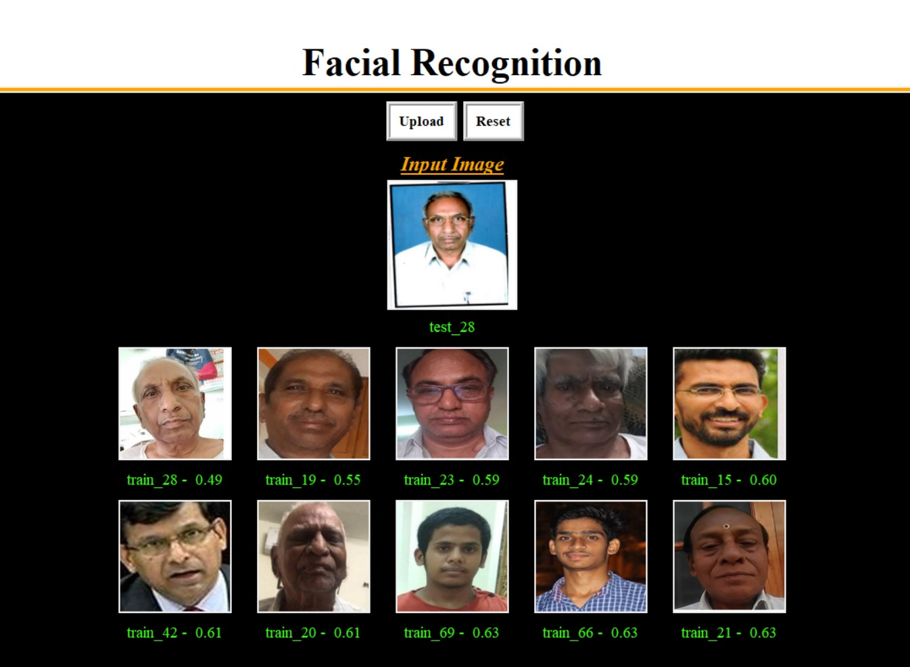
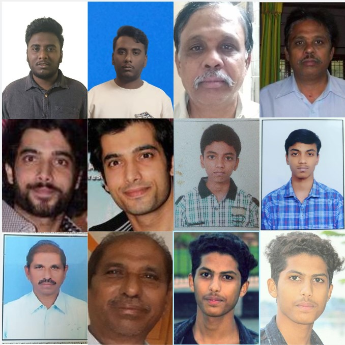

<h1 align="center"> A deep learning based facial recognition application. </h1>  

  A facial recognition application build using python with a easy to use GUI.

## Contents

- [Introduction](#introduction)
- [Features](#features)
- [Output Screenshot](#outputscreenshot)
- [Data Collection and Dataset Creation](#datacollectionanddatasetcreation)

## Introduction
This is a python based facial recognition application with an easy to use GUI and makes use of deep learning based image embeddings generated using the [face_recogiton](https://github.com/ageitgey/face_recognition) python libray for doing facial recognition. 

## Features
This facial recognition library can be used both via GUI. It's features are as follows:
* Displays top 10 matches of the given input image from the database.
* Shows euclidean distance between the input image and each match.

## Output Screenshot

## Data Collection and Dataset Creation
* The dataset contains images of indian people looking straight, similar to in a passport photo.
* The data was collected from various sources such as google images, public facebook accounts and photos taken of physical photos.

